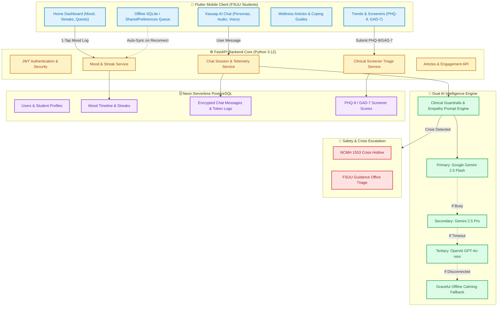
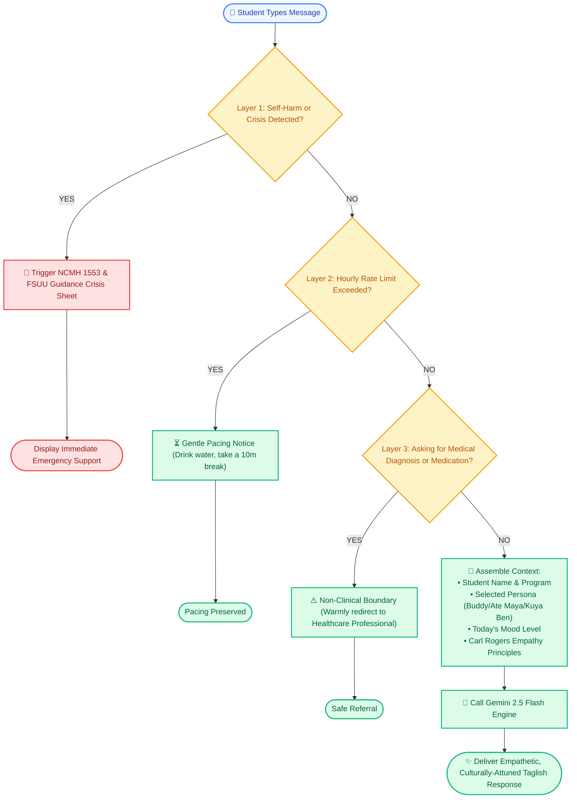
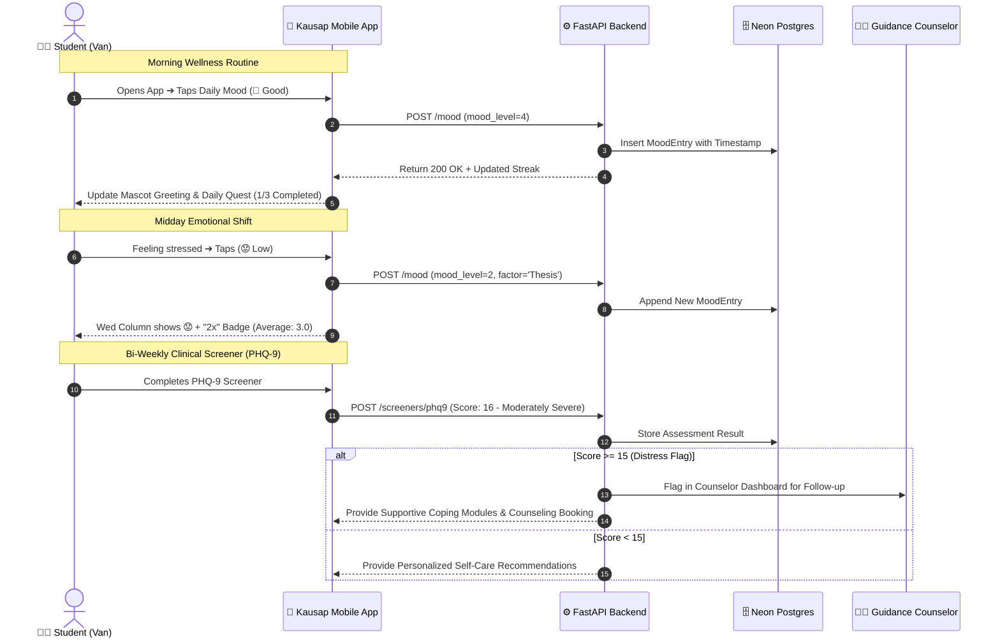

# Kausap AI — Comprehensive System Flowcharts

These flowcharts are structured specifically for your **Thesis / Capstone Defense**, showcasing the complete architectural flow, clinical safety guardrails (RA 11036 compliance), and AI empathy engine.

---

## 🏗️ 1. Complete End-to-End System Architecture Flowchart

---

## 🤖 2. AI Conversational Pipeline & Ethical Guardrails Flowchart

This flowchart demonstrates how Kausap AI processes every chat message to maintain ethical boundaries and zero-diagnosis safety.

---

## 🌿 3. Student Daily Wellness & Counselor Triage Journey

